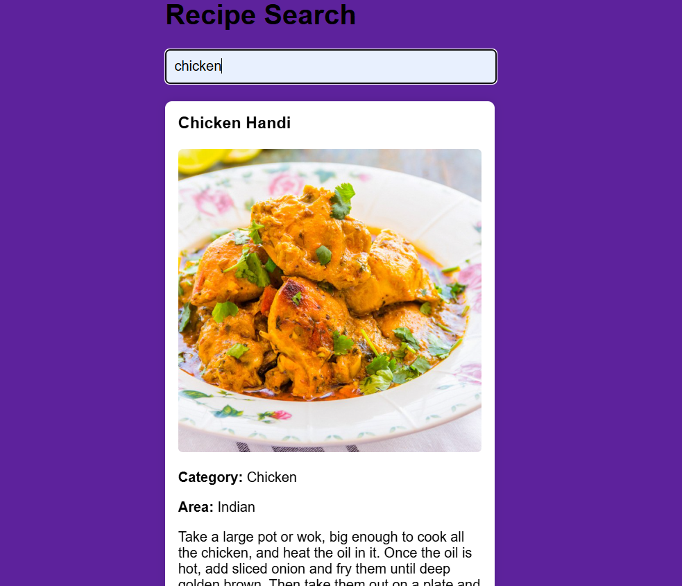
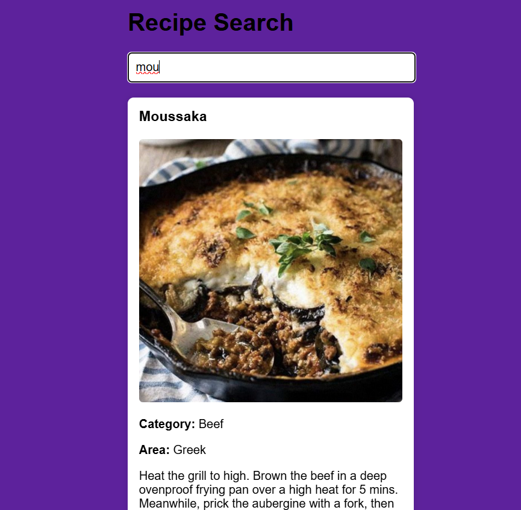
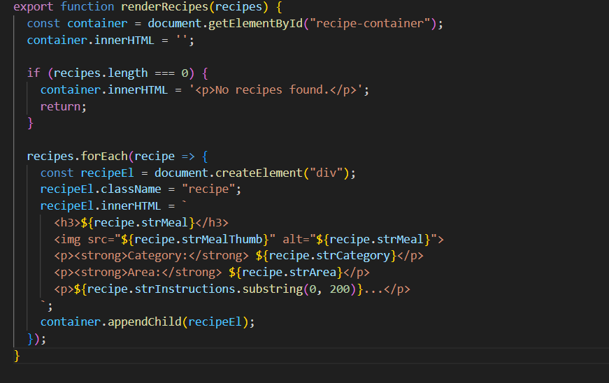

# Recipe

> The **Recipe** project allows users to search for recipes by name using the [TheMealDB API](https://www.themealdb.com/api.php). When a user enters a recipe name, the app fetches and displays key details such as the dish's image, name, category, cuisine (area), and preparation instructions. This is a simple and interactive way to explore meals from around the world.

- [Recipe](#recipe)
  - [General Info](#general-info)
  - [Screenshots](#screenshots)
  - [Code Example](#code-example)
  - [Technologies](#technologies)
  - [Status](#status)
  - [Inspiration](#inspiration)
  - [Contact](#contact)

---

## General Info

> This project enables users to search for meals by name and retrieve real-time recipe data using TheMealDB API. It provides essential information such as the meal's name, image, category, area (cuisine), and step-by-step instructions. The project is designed to strengthen skills in working with APIs, DOM manipulation, and creating clean, modular web apps with HTML, CSS, and JavaScript.

---

## Screenshots

  
  

---

## Code Example

---

## Technologies

- HTML5
- CSS3 (Flexbox, Media Queries)
- JavaScript (ES Modules, async/await)
- [TheMealDB API](https://www.themealdb.com/api.php)
- Git & GitHub
- VS Code (Editor)

---

## Status

**Project Completed**

---

## Inspiration

Created as a personal learning project to improve skills in:
- Fetching and displaying API data
- Writing modular JavaScript
- Designing responsive, user-friendly interfaces
- Practicing clean, maintainable coding practices

---

## Contact

**Sajid Hussain**  
[GitHub Profile](https://github.com/SajidHussainabbasi)

---
