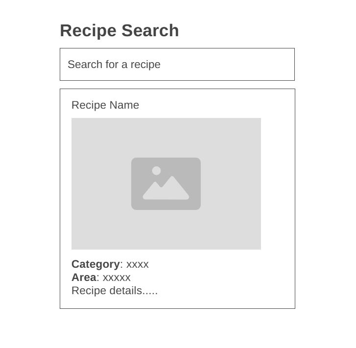

# Design

## Project's Design Overview

The **Recipe** web application offers a user-friendly way for individuals to search and view recipes using a public API such as [TheMealDB](https://www.themealdb.com/api.php). It displays essential recipe information including the name, cuisine, category, instructions, and an image.

- **Clean & Focused UI**: Simple and visually clear interface with a centered search bar and recipe results.
- **Responsive Layout**: Optimized for both desktop and mobile screens with flexible containers and media queries.
- **Modular Code Structure**: Organizes the project into reusable parts—API calls, UI components, event listeners, and handler functions.
- **User-Friendly Search**: Allows recipe search via input from user.

---

## Wireframe  

